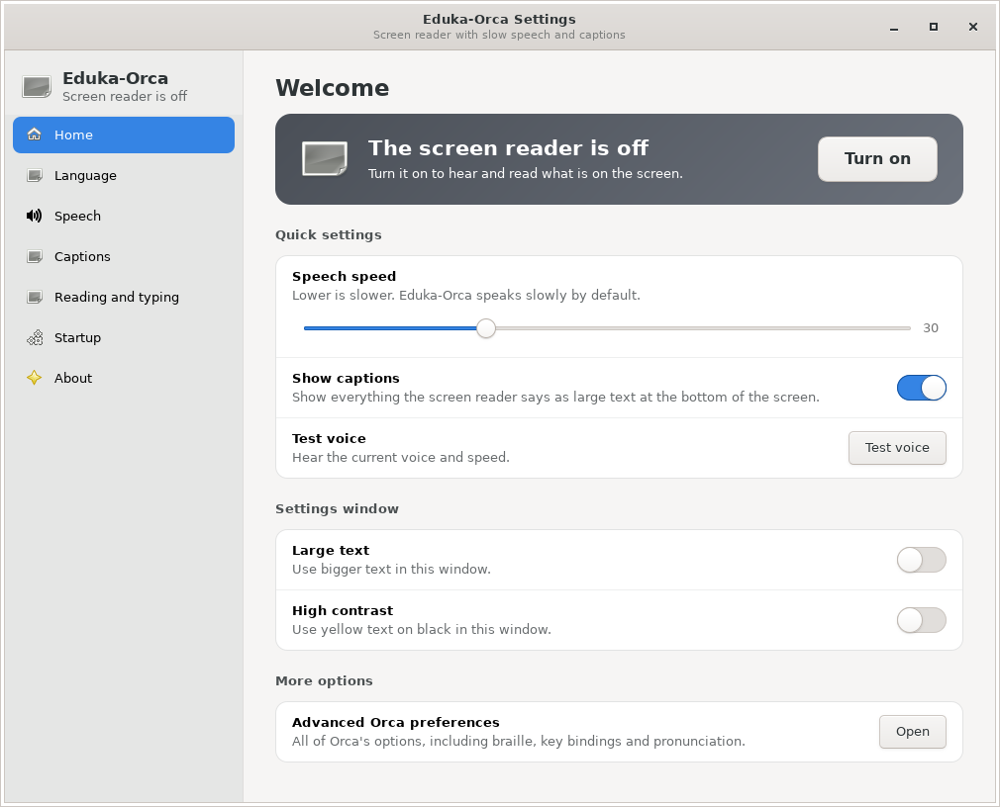
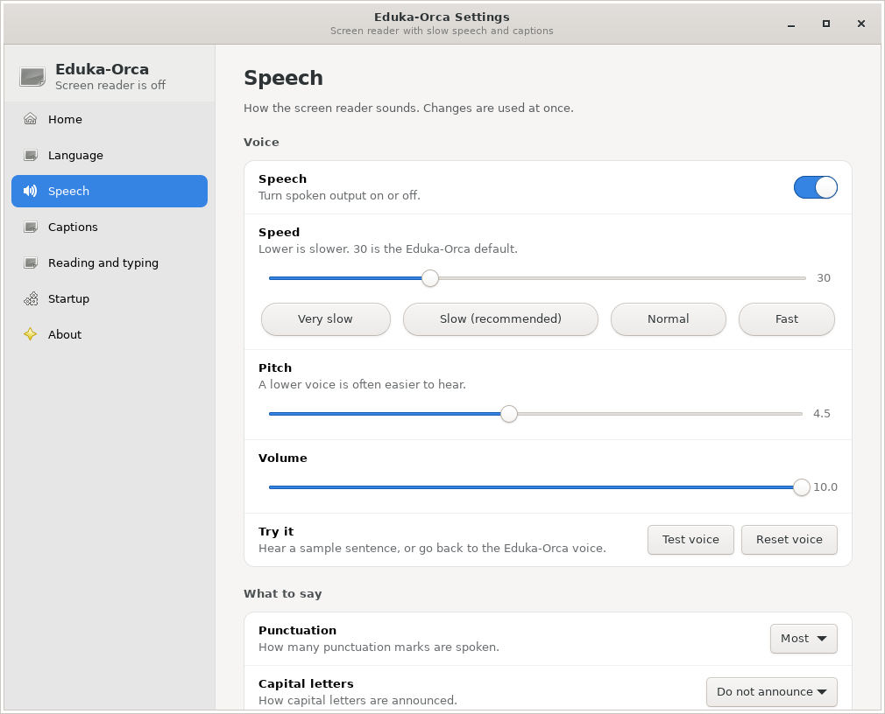
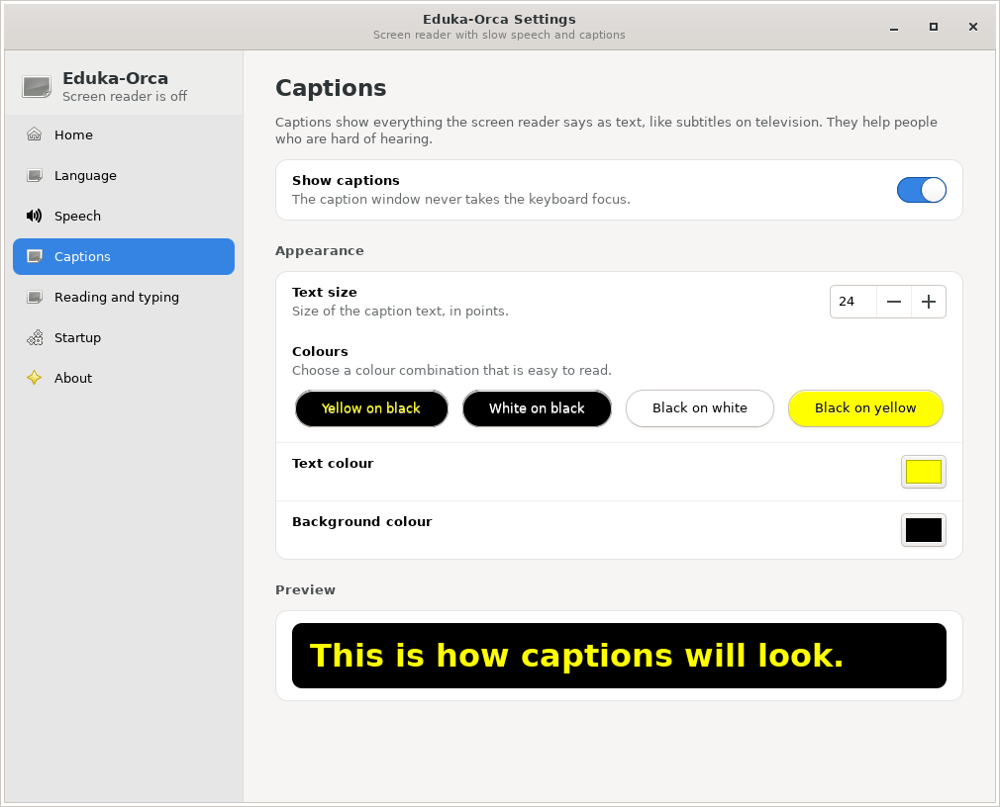
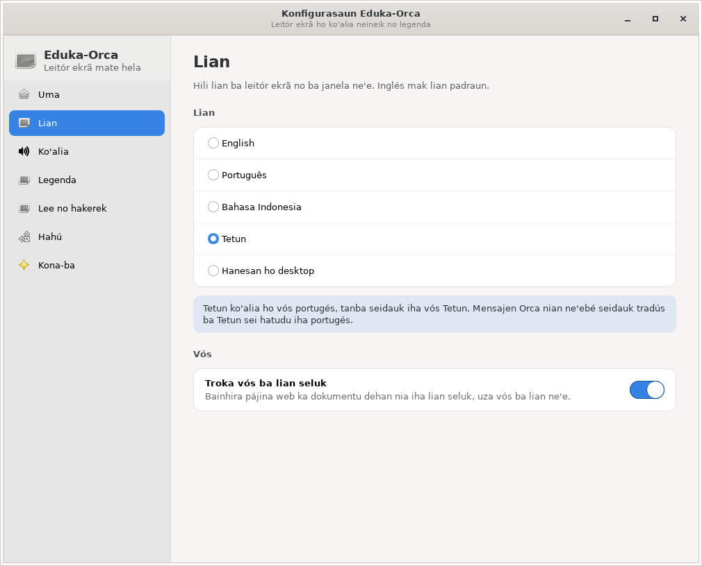

# Eduka-Orca

The **Orca 50.3** screen reader for **Edukasaun OS / Eduka-Desktop (LXQt)**,
with slower speech, on-screen captions for people who are hard of hearing,
and a simple settings window.

Languages: **English** (default), **Português**, **Bahasa Indonesia** and
**Tetun**.



## Features

* **Slow, clear speech by default**: rate 30 instead of 50, pitch 4.5
  instead of 5.0, full volume.
* **On-screen captions**: everything Orca says is shown as large
  yellow-on-black text at the bottom of the screen, like TV subtitles. The
  caption window never takes keyboard focus.
* **Eduka-Orca Settings** (`eduka-orca-settings`), a redesigned settings
  window with one page per topic:

  | Page | Options |
  |---|---|
  | Home | Screen reader on/off, speech speed, captions, voice test, large text and high contrast for the window, advanced Orca preferences |
  | Language | English (default), Português, Bahasa Indonesia, Tetun, or the desktop language; automatic voice switching for other languages |
  | Speech | Speech on/off, speed with *Very slow / Slow / Normal / Fast* presets, pitch, volume, test and reset voice, punctuation, capital letters, numbers as digits |
  | Captions | Captions on/off, text size, colour presets and custom colours, live preview |
  | Reading and typing | Amount of detail, tutorial messages, read under the mouse, desktop/laptop keyboard layout, speak keys/characters/words/sentences, sounds, braille |
  | Startup | Start at login: *Remember*, *Always* or *Never*; delay before starting; welcome message; on/off notifications |
  | About | Version, keyboard shortcuts, reset all settings |

  Changes are saved at once and applied live to the running screen reader.
* **Tetum support**: Tetum uses a European Portuguese voice (eSpeak NG has no
  Tetum voice) and falls back to Portuguese for Orca messages that are not yet
  translated into Tetum.
* **LXQt integration**: autostart, Qt accessibility environment, an
  *Eduka-Orca* menu entry, an on/off toggle (`eduka-orca-toggle`
  `--on | --off | --restart | --status`) with desktop notifications, and a
  Super+Alt+S shortcut snippet.
* Defaults can be changed system-wide with a GSettings override file; see
  `eduka/README.Eduka.md` in the patched source.

| Speech | Captions | Language (Tetun) |
|---|---|---|
|  |  |  |

## What is in this repository

This repository does **not** copy the whole Orca source (thousands of files).
It only holds the Eduka changes as patches; the original Orca source is
downloaded from [GNOME/orca](https://github.com/GNOME/orca) at build time.

```
patches/                     Eduka changes to Orca 50.3
  0001-...caption.patch      slow speech (rate 30, pitch 4.5), on-screen captions, Portuguese voice for Tetum
  0002-...overrida.patch     LXQt integration, Eduka-Orca menu entry, toggle, system-wide defaults
  0003-...packaging.patch    debian/ folder (eduka-orca package) and man page
  0004-...Tetum.patch        Eduka-Orca Settings window, English default, Portuguese/Indonesian/Tetum
build.sh                     downloads Orca 50.3 and applies the patches (and builds the .deb)
docs/screenshots/            screenshots of Eduka-Orca Settings
```

## Building the package

On Debian 13 / Edukasaun OS:

```sh
sudo apt install git devscripts equivs build-essential
./build.sh deb        # result: build/eduka-orca_50.3+eduka2_all.deb
sudo apt install ./build/eduka-orca_50.3+eduka2_all.deb
```

To only prepare the patched source (no build): `./build.sh`

The package build runs the Eduka unit tests
(`tests/unit_tests/test_eduka_defaults.py` and
`tests/unit_tests/test_eduka_settings.py`).

## Changing the code

```sh
./build.sh
cd build/eduka-orca-50.3+eduka2
# ... edit files, then commit ...
git commit -am "Eduka-Orca: describe the change"
git format-patch 50.3..HEAD -o ../../patches   # remove the old patches first
```

### Translations

The settings window is translated with gettext (domain `eduka-orca`). The
translation files are `eduka/po/pt.po`, `eduka/po/id.po` and
`eduka/po/tet.po` in the patched source. English is the source language, so
new strings only need to be added to those three files. The Tetum
translations should be reviewed by Tetum speakers; corrections are welcome.

All the details of the changes are in `eduka/README.Eduka.md` in the patched
source.

## License

LGPL-2.1-or-later, the same as Orca (see `COPYING`).
